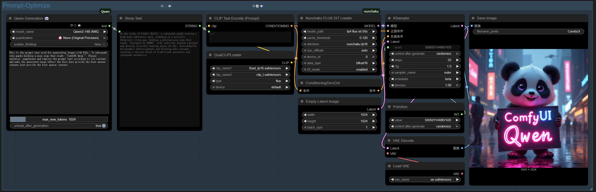

<div align="center">

# ComfyUI-Qwen 🐼
<p align="center">
        <a href="README_zh.md">中文</a> &nbsp｜ &nbsp English
</p>

**Where Figma meets VSCode: Artistic vision meets engineering precision —— a romantic manifesto from designers to the code world.**  
✨ The Qwen3 ComfyUI Integration is a powerful tool designed specifically for ComfyUI workflows, aiming to seamlessly integrate Qwen series large language models (LLMs). This component provides both single-turn generation and multi-turn conversation nodes, supporting advanced features such as automatic model download, intelligent memory management, and a "thinking mode". ✨
  
[](https://github.com/SXQBW/ComfyUI-Qwen/stargazers)
[](https://huggingface.co/Qwen)
</div>
<div align="center">
  
</div>

---

## 🚀 Why Choose ComfyUI-Qwen?

At the intersection of creativity and technology, ComfyUI-Qwen serves as your intelligent creative companion. Through an intuitive visual interface, it seamlessly integrates Qwen series large language models, empowering creators, developers, and AI enthusiasts with powerful multimodal generation capabilities.

### 🌟 Key Features

| Feature Category | Detailed Description |
|------------------|----------------------|
| **Model Support** | Comprehensive coverage of Qwen3 series models (from 0.6B to 235B, catering to various scenarios) |
| **Intelligent Device Adaptation** | Automatically detects the optimal running device (GPU/CPU/MPS) and optimizes configuration |
| **Dual-source Accelerated Download** | Automatically selects the fastest download source (Hugging Face/ModelScope) with resume support |
| **Quantization Technology** | Supports 4-bit/8-bit quantization, significantly reducing VRAM requirements (min 2GB VRAM) |
| **Thinking Mode** | Enhances complex task processing capabilities with transparent reasoning and customizable thinking markers |

### 💻 Installation

1. Navigate to the `custom_nodes` directory of ComfyUI
2. Clone this repository:
   ```bash
   git clone https://github.com/SXQBW/ComfyUI-Qwen3.git
   ```
3. Install dependencies:
   ```bash
   cd ComfyUI-Qwen3
   pip install -r requirements.txt
   ```
4. Restart ComfyUI

## 🎯 Examples

### Multi-turn Conversation Node (Qwen Conversation)

This node supports full multi-turn conversations, maintaining conversation history, suitable for chatbot applications and prompt expansion in image generation workflows:


Prompt expansion result 1 for Flux image generation


Prompt expansion result 2 for Flux image generation


1. Select the model version (Qwen3-7B recommended by default)
2. Choose the quantization level (4-bit for low VRAM devices, 8-bit balances precision and performance)
3. Enable or disable "thinking mode" (suitable for complex reasoning tasks)
4. Enter your prompt text
5. Adjust the maximum generation length
6. Choose whether to unload the model after generation to free up resources

### Single-turn Generation Node (Qwen Generation)

This node focuses on single text generation, suitable for prompt engineering, text expansion, and other tasks:

Single-turn generation node example 1



Single-turn generation node example 2


1. Select the model version
2. Choose the quantization level
3. Enable or disable "thinking mode"
4. Enter your prompt text
5. Adjust the maximum generation length
6. Choose whether to unload the model after generation to free up resources

### 🛠️ Technical Details

#### Memory Management

The component automatically detects your device (GPU/CPU/MPS) and selects the optimal running configuration:

- NVIDIA GPU users: Automatically uses CUDA and adjusts quantization based on VRAM size
- Apple Silicon users: Automatically uses MPS acceleration
- Low memory devices: Automatically downgrades to 4-bit quantization to save resources

#### Model Download

The component automatically tests download speeds from Hugging Face and ModelScope, selecting the fastest source. If download fails, it automatically tries the other source, with up to 3 retries.

#### Thinking Mode

The "thinking mode" is implemented through a special tagging mechanism, adding thinking process markers to the output during generation:

- When enabled: Shows the complete thinking process
- When disabled: Automatically filters thinking content, showing only the final result

### 📚 Supported Models

The following Qwen model versions are currently supported:

| Model Name | Parameters | Recommended VRAM | Quantization Support |
|------------|------------|------------------|----------------------|
| Qwen3-0.6B-FP8 | 600M | 2GB | ✅ |
| Qwen3-0.6B-Base | 600M | 2GB | ✅ |
| Qwen3-0.6B | 600M | 2GB | ✅ |
| Qwen3-1.7B-FP8 | 1.7B | 4GB | ✅ |
| Qwen3-1.7B-Base | 1.7B | 4GB | ✅ |
| Qwen3-1.7B | 1.7B | 4GB | ✅ |
| Qwen3-4B-FP8 | 4B | 8GB | ✅ |
| Qwen3-4B-Base | 4B | 8GB | ✅ |
| Qwen3-4B | 4B | 8GB | ✅ |
| Qwen3-8B-FP8 | 8B | 12GB | ✅ |
| Qwen3-8B-Base | 8B | 12GB | ✅ |
| Qwen3-8B | 8B | 12GB | ✅ |
| Qwen3-14B-FP8 | 14B | 20GB | ✅ |
| Qwen3-14B-AWQ | 14B | 8GB | ✅ |
| Qwen3-14B-Base | 14B | 20GB | ✅ |
| Qwen3-14B | 14B | 20GB | ✅ |
| Qwen3-14B-GGUF | 14B | 8GB | ✅ |
| Qwen3-30B-A3B-FP8 | 30B | 40GB | ✅ |
| Qwen3-30B-A3B | 30B | 40GB | ✅ |
| Qwen3-30B-A3B-Base | 30B | 40GB | ✅ |
| Qwen3-32B-FP8 | 32B | 40GB | ✅ |
| Qwen3-32B-AWQ | 32B | 12GB | ✅ |
| Qwen3-32B | 32B | 40GB | ✅ |
| Qwen3-32B-GGUF | 32B | 12GB | ✅ |
| Qwen3-235B-A22B-FP8 | 235B | 300GB | ✅ |
| Qwen3-235B-A22B | 235B | 300GB | ✅ |

### 🤝 Contributing

We welcome community contributions! If you find issues or have suggestions for improvement, please submit an issue or pull request.

### 💌 Acknowledgments

Special thanks to the Qwen team for developing these powerful models, and to the ComfyUI community for their support!

**The star you're about to click ✨**  
Is not just a gesture of approval, but a cosmic explosion where design thinking meets the code universe. When an artist's aesthetic obsession collides with a programmer's geek spirit – this might just be the most romantic chemical reaction on GitHub.

[Click to Star and Witness the Cross-Disciplinary Revolution](https://github.com/SXQBW/ComfyUI-Qwen)
