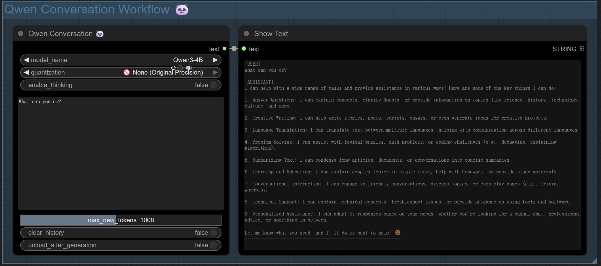
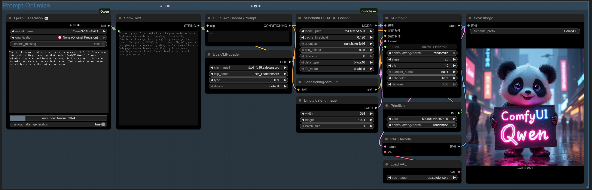
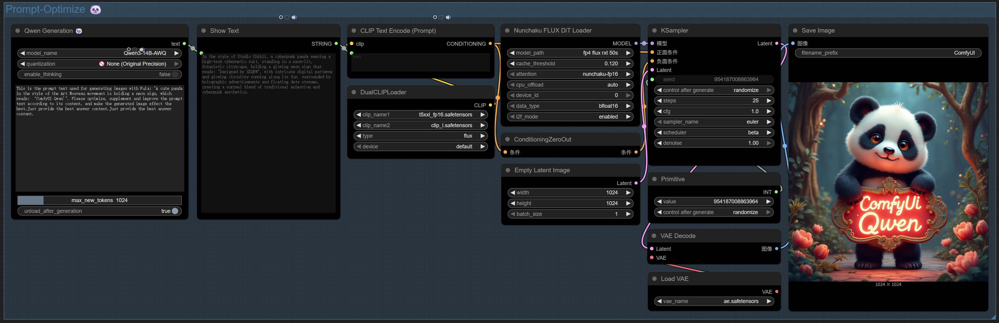

<div align="center">

# ComfyUI-Qwen 🐼
<p align="center">
        <a href="README.md">English</a> &nbsp｜ &nbsp 中文
</p>

**Where Figma meets VSCode: Artistic vision meets engineering precision —— a romantic manifesto from designers to the code world.**  
✨ Qwen3 ComfyUI 集成组件是一个强大的工具，专为ComfyUI工作流设计，旨在无缝集成Qwen系列大型语言模型（LLM）。这个组件提供了单轮生成和多轮对话两种节点，支持自动模型下载、智能内存管理和"思考模式"等高级功能。 ✨
  
[](https://github.com/SXQBW/ComfyUI-Qwen/stargazers)
[](https://huggingface.co/Qwen)
</div>
<div align="center">
  
</div>

---
## 🚀 为什么选择 ComfyUI-Qwen？

在创意与技术的交汇处，ComfyUI-Qwen 是您的智能创作伙伴。通过直观的可视化界面，无缝集成 Qwen 系列大模型，为创作者、开发者和 AI 爱好者提供了强大的多模态生成能力。


### 🌟 主要特点


| 特性类别 | 详细描述 |
|----------|----------|
| **模型支持** | 覆盖 Qwen3 全系列模型（从 0.6B 到 235B，满足不同场景需求） |
| **智能设备适配** | 自动检测最佳运行设备（GPU/CPU/MPS）并优化配置 |
| **双源加速下载** | 自动选择最快下载源（Hugging Face/ModelScope），支持断点续传 |
| **量化技术** | 支持 4-bit/8-bit 量化，显著降低显存需求，最小仅需 2GB 显存 |
| **思考模式** | 增强复杂任务处理能力，提供透明的推理过程，可自定义思考标记 |


### 💻 安装

1. 打开ComfyUI的custom_nodes目录
2. 克隆此仓库：
   ```bash
   git clone https://github.com/SXQBW/ComfyUI-Qwen3.git
   ```
3. 安装依赖：
   ```bash
   cd ComfyUI-Qwen3
   pip install -r requirements.txt
   ```
4. 重启ComfyUI


## 🎯 示例

#### 多轮对话节点 (Qwen Conversation)

此节点支持完整的多轮对话，维护对话历史，适合文生图如Flux提示词扩展完善，聊天机器人等应用：


对Flux提示词扩展完善生图效果1

对Flux提示词扩展完善生图效果2


1. 选择模型版本（默认推荐Qwen3-7B）
2. 选择量化级别（4-bit适合低显存设备，8-bit平衡精度和性能）
3. 启用或禁用"思考模式"（适合复杂推理任务）
4. 输入您的提示文本
5. 调整最大生成长度
6. 选择是否在生成后卸载模型以释放资源

#### 单轮生成节点 (Qwen Generation)

此节点专注于单次文本生成，适合文生图如Flux提示词优化、文本扩展等任务：

单轮生成节点示例 1




单轮生成节点示例 2



1. 选择模型版本
2. 选择量化级别
3. 启用或禁用"思考模式"
4. 输入您的提示文本
5. 调整最大生成长度
6. 选择是否在生成后卸载模型以释放资源

### 🛠️ 技术细节

#### 内存管理

组件会自动检测您的设备（GPU/CPU/MPS）并选择最佳运行配置：

- NVIDIA GPU用户：自动使用CUDA并根据显存大小调整量化级别
- Apple Silicon用户：自动使用MPS加速
- 低内存设备：自动降级到4-bit量化以节省资源

#### 模型下载

组件会自动测试Hugging Face和ModelScope的下载速度，选择最快的源进行下载。如果下载失败，会自动尝试另一个源，最多重试3次。

#### 思考模式

"思考模式"通过特殊的标签机制实现，在生成过程中会在输出中添加思考过程标记：

- 启用时：会显示完整的思考过程
- 禁用时：会自动过滤思考内容，只保留最终结果


### 📚 支持的模型

当前支持以下 Qwen 模型版本：


| 模型名称 | 参数量 | 推荐显存 | 量化支持 |
|----------|--------|----------|----------|
| Qwen3-0.6B-FP8 | 600M | 2GB | ✅ |
| Qwen3-0.6B-Base | 600M | 2GB | ✅ |
| Qwen3-0.6B | 600M | 2GB | ✅ |
| Qwen3-1.7B-FP8 | 1.7B | 4GB | ✅ |
| Qwen3-1.7B-Base | 1.7B | 4GB | ✅ |
| Qwen3-1.7B | 1.7B | 4GB | ✅ |
| Qwen3-4B-FP8 | 4B | 8GB | ✅ |
| Qwen3-4B-Base | 4B | 8GB | ✅ |
| Qwen3-4B | 4B | 8GB | ✅ |
| Qwen3-8B-FP8 | 8B | 12GB | ✅ |
| Qwen3-8B-Base | 8B | 12GB | ✅ |
| Qwen3-8B | 8B | 12GB | ✅ |
| Qwen3-14B-FP8 | 14B | 20GB | ✅ |
| Qwen3-14B-AWQ | 14B | 8GB | ✅ |
| Qwen3-14B-Base | 14B | 20GB | ✅ |
| Qwen3-14B | 14B | 20GB | ✅ |
| Qwen3-14B-GGUF | 14B | 8GB | ✅ |
| Qwen3-30B-A3B-FP8 | 30B | 40GB | ✅ |
| Qwen3-30B-A3B | 30B | 40GB | ✅ |
| Qwen3-30B-A3B-Base | 30B | 40GB | ✅ |
| Qwen3-32B-FP8 | 32B | 40GB | ✅ |
| Qwen3-32B-AWQ | 32B | 12GB | ✅ |
| Qwen3-32B | 32B | 40GB | ✅ |
| Qwen3-32B-GGUF | 32B | 12GB | ✅ |
| Qwen3-235B-A22B-FP8 | 235B | 300GB | ✅ |
| Qwen3-235B-A22B | 235B | 300GB | ✅ |

### 🤝 贡献

我们欢迎社区贡献！如果您发现问题或有改进建议，请提交 issue 或 pull request。

### 💌 致谢

感谢 Qwen 团队开发的强大模型，以及 ComfyUI 社区的支持！

**此刻，你指尖的星星✨**  
不仅是认可，更是设计思维与代码世界碰撞的宇宙大爆炸。当艺术生的美学执念遇上程序员的极客精神——这可能是 GitHub 上最浪漫的化学反应。

[点击 Star 见证跨界革命](https://github.com/SXQBW/ComfyUI-Qwen)
